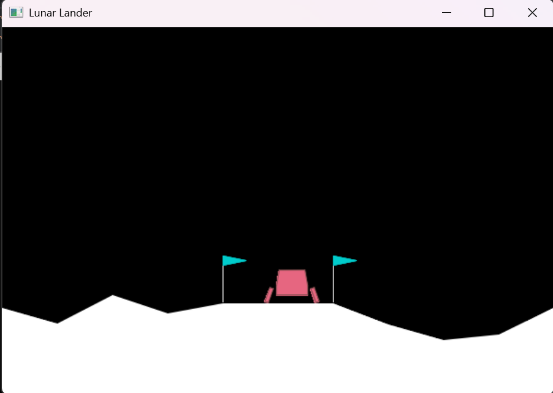

# Lunar Lander DQN

A Deep Q-Network (DQN) implementation for solving OpenAI Gym's Lunar Lander environment using TensorFlow.

## Project Overview

This project implements a DQN agent that learns to land a lunar module safely on a landing pad. The agent learns through trial and error, using deep reinforcement learning to master the challenging task of lunar landing.

## Features

- DQN implementation with experience replay
- Target network for stable learning
- Real-time training visualization
- Performance metrics tracking
- Model evaluation tools

## Requirements

### Prerequisites
- Python 3.11
- Visual Studio with C++ build tools (required for Box2D-py installation)
- Git (optional, for cloning the repository)

### Development Environment Setup
1. Install Visual Studio (if not already installed)
   - Download Visual Studio Community Edition from the [official website](https://visualstudio.microsoft.com/downloads/)
   - During installation, make sure to select "Desktop development with C++"
   - Install the Windows SDK

2. Install Python dependencies
   ```bash
   pip install -r requirements.txt
   ```

Note: The Box2D-py package requires Visual Studio C++ build tools for compilation. If you encounter any installation issues, ensure that Visual Studio and C++ build tools are properly installed.

Key dependencies include:
- TensorFlow 2.12.0
- OpenAI Gym 0.24.1
- Pandas
- Matplotlib
- OpenCV-Python
- Box2D

## Project Structure

```
├── dqn_lander.py      # Main training script
├── evaluator.py       # Model evaluation script
├── plotter.py         # Training metrics visualization
├── requirements.txt   # Project dependencies
└── README.md         # Project documentation
```

## Usage

1. **Training the Agent**
   ```bash
   python dqn_lander.py
   ```
   This will start the training process and save the model and metrics.

2. **Visualizing Training Progress**
   ```bash
   python plotter.py
   ```
   This will show four real-time plots:
   - Total reward per episode
   - Average Q-value
   - Episode length
   - Exploration rate (epsilon)

3. **Evaluating the Trained Agent**
   ```bash
   python evaluator.py
   ```
   This will load the trained model and run 5 evaluation episodes with visualization.

## Training Parameters

- Episodes: 600
- Max Transitions: 100,000
- Batch Size: 64
- Learning Rate: 0.001
- Discount Factor (γ): 0.99
- Initial Exploration Rate (ε): 1.0
- Exploration Decay: 1.005
- Target Network Update Frequency: 1000 steps
- Learning Frequency: Every 4 steps

## Network Architecture

The DQN uses a neural network with:
- Input layer: 8 neurons (state space)
- 3 hidden layers with 64 neurons each (ReLU activation)
- Output layer: 4 neurons (action space, linear activation)

## License

This project is licensed under the MIT License - see the [LICENSE](LICENSE) file for details.

## Contributing

Feel free to open issues or submit pull requests if you find any bugs or have suggestions for improvements.

## Acknowledgments

- OpenAI Gym for providing the Lunar Lander environment
- Box2D for the physics engine
- TensorFlow team for the deep learning framework

---
Note: This implementation is for educational purposes and demonstrates basic concepts of deep reinforcement learning.

## Training Results

The training progress is visualized through four key metrics:

1. **Total Reward per Episode**: Shows the agent's performance improvement over time, with initial negative rewards gradually improving as the agent learns better landing strategies.

2. **Average Q-Value**: Demonstrates the agent's learning progression through increasing Q-values, indicating better action-value estimation.

3. **Episode Length**: Displays how long each training episode lasts, with longer episodes generally indicating better landing control.

4. **Exploration Rate**: Shows the decay of the exploration parameter (epsilon) over time, gradually shifting from exploration to exploitation.



